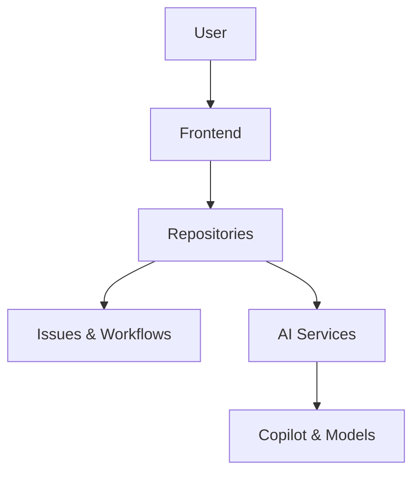

## Overview

Kayel Calleja provides a comprehensive platform for building, collaborating, and innovating with AI-powered developer tools. You interact with repositories to store code, issues to track work, and workflows to automate processes. AI features like Copilot accelerate coding, while security and permissions ensure safe collaboration.

<Columns cols={3}>
  <Card title="Architecture" icon="layers" href="#">
    Modular design with repositories, AI services, and secure workflows.
  </Card>
  <Card title="AI Integration" icon="zap" href="#">
    Copilot and Models enhance productivity with intelligent assistance.
  </Card>
  <Card title="Security" icon="shield" href="#">
    Advanced protections for code and secrets.
  </Card>
</Columns>

## Platform Architecture

Kayel Calleja follows a layered architecture: frontend for user interaction, core services for repositories and workflows, and AI backend for intelligent features. Repositories act as the central hub, integrating with issues for planning and Actions for automation.



This structure ensures scalability and seamless integration.

## Repositories, Issues, and Workflows

Repositories store your code and history. Issues help plan and track tasks. Workflows automate CI/CD pipelines.

<Tabs>
  <Tab title="Repositories" icon="git-branch">
    Create a repository to version control your projects.
    
    ```javascript
    // Example: Initialize a repo via API
    const response = await fetch('https://api.example.com/repos', {
      method: 'POST',
      headers: { Authorization: `Bearer YOUR_TOKEN` },
      body: JSON.stringify({ name: 'my-project', private: true })
    });
    ```
  </Tab>
  <Tab title="Issues" icon="issue-closed">
    Track bugs and features with rich metadata.
    
    | Field     | Type    | Description                  |
    |-----------|---------|------------------------------|
    | title     | string  | Issue summary                |
    | labels    | array   | Tags like `bug`, `enhancement` |
    | assignee  | object  | User responsible             |
  </Tab>
  <Tab title="Workflows" icon="play">
    Automate deployments using YAML files.
    
````yaml
name: CI
on: [push]
jobs:
  test:
    runs-on: ubuntu-latest
    steps:
      - uses: actions/checkout@v4
      - run: npm test
````
  </Tab>
</Tabs>

## AI Integration Basics

Integrate AI tools like Copilot for code suggestions and Models for prompt management. Start by enabling Copilot in your repository settings.

<CodeGroup tabs="JavaScript,Python">
```javascript
// Using Copilot API for code completion
import { Copilot } from '@kayelcalleja/ai';

const copilot = new Copilot({ apiKey: 'YOUR_API_KEY' });
const suggestions = await copilot.complete('function add(a, b) {');
console.log(suggestions);
```
```python
# Python example with Models
from kayelcalleja.models import ModelClient

client = ModelClient(api_key='YOUR_API_KEY')
response = client.compare_prompts('Generate README', model='gpt-4')
print(response)
```
</CodeGroup>

<Callout kind="tip">
  Store your `{API_KEY}` securely using environment variables, not in code.
</Callout>

## Collaboration Features

Kayel Calleja supports team collaboration through pull requests, reviews, and fine-grained permissions.

<ExpandableGroup>
  <Expandable title="Permissions Model" default-open="true">
    Roles include Owner (full access), Maintainer (merge PRs), and Collaborator (read/write).
    
    Use branch protection rules to require reviews before merging.
  </Expandable>
  <Expandable title="Pull Requests">
    Create PRs to propose changes. Reviewers add comments and approvals.
  </Expandable>
</ExpandableGroup>

## Security Concepts and Best Practices

Security is built-in with Advanced Security, secret scanning, and dependency checks.

<Steps>
  <Step title="Enable Secret Protection" icon="lock">
    Activate in repository settings to scan for leaked keys.
  </Step>
  <Step title="Run Vulnerability Scans" icon="alert-triangle">
    
````bash
# Integrate into workflow
npm audit
./gradlew dependencyCheckAnalyze
````
    
  </Step>
  <Step title="Use Signed Commits" icon="check-circle">
    Configure GPG for commit verification.
  </Step>
</Steps>

<Callout kind="alert">
  Never commit real secrets. Use `YOUR_SECRET` placeholders and manage via environment variables.
</Callout>

Master these concepts to leverage Kayel Calleja effectively for your projects.